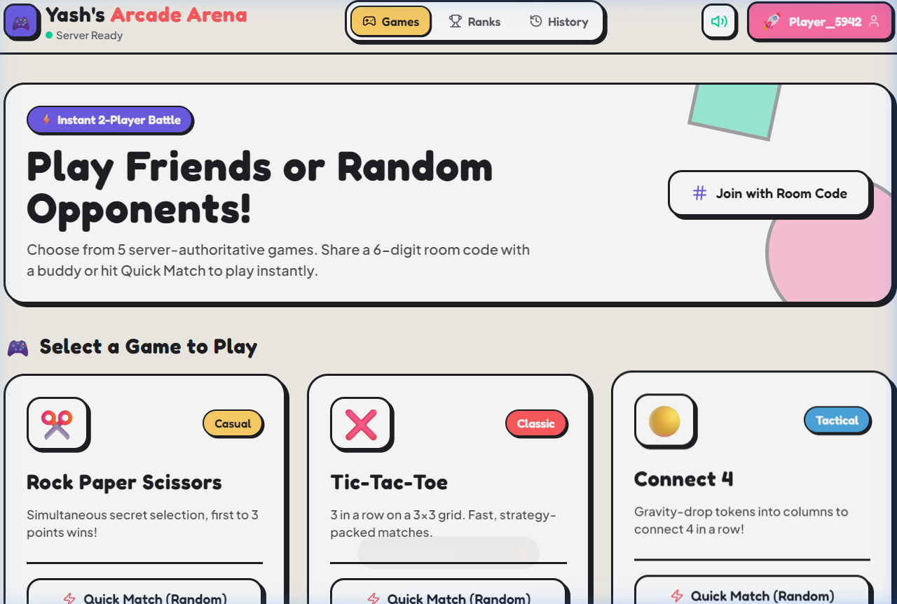
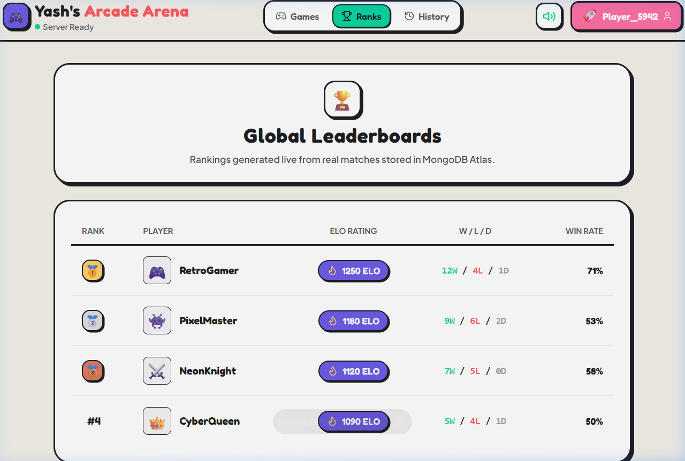
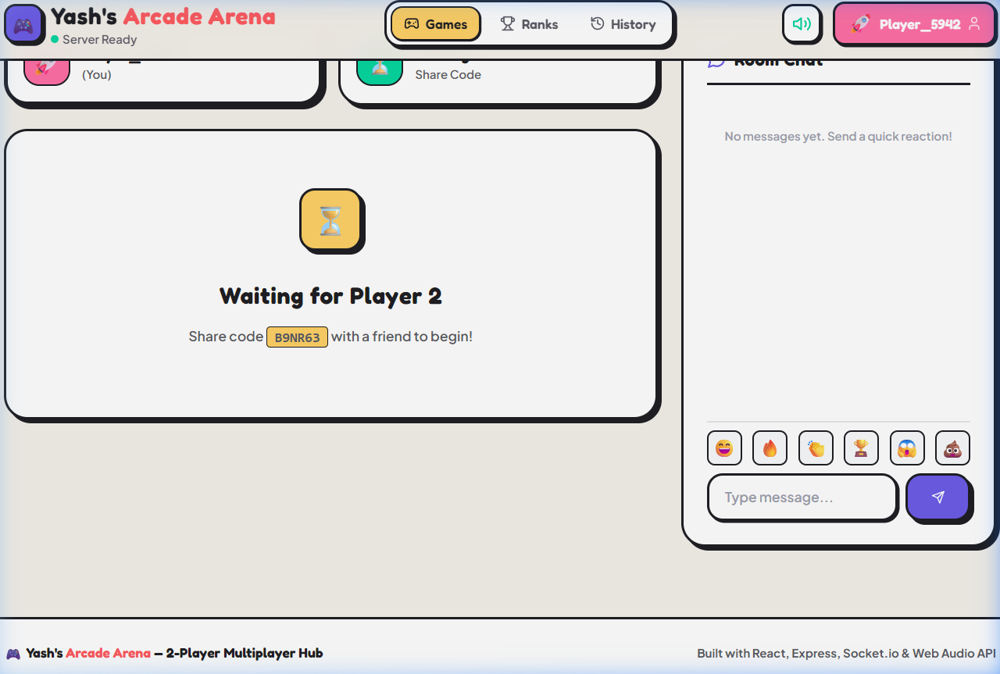

# 🎮 Yash's Arcade Arena — Real-Time Multiplayer Games Platform

Arcade Arena is a feature-rich, real-time multiplayer 2-player gaming hub. Players can join game lobbies, match up with others, chat, and track scores across multiple games.

**This project was created to learn and improve my web development and engineering skills**, specifically focusing on real-time WebSockets communication, WebRTC media streaming, and scalable database integrations.

---

## 📸 Screenshots

### 🏠 Game Lobby & Dashboard


### 🏆 Global Leaderboard & Match History


### 🕹️ Real-Time Game Room


---

## ⚡ Key Features

1. **5 Classic Real-Time Multiplayer Games**:
   - **Connect 4**: Drop colored discs to form a line of 4.
   - **Checkers**: Capture all of your opponent's pieces.
   - **Dots & Boxes**: Complete boxes to score.
   - **Tic-Tac-Toe**: Classic 3-in-a-row board game.
   - **Rock Paper Scissors**: Quick action game with animated results.

2. **In-Room Game Switching & Multi-Game Scoreboards**:
   - Play another game without creating a new room. Switch games mid-session and watch the board reload instantly.
   - A persistent **Championship Scoreboard** banner tracks overall wins, losses, and draws for players during their session.

3. **Lobby & Matchmaking System**:
   - **Create / Join Rooms**: Create a room with a custom 6-digit code.
   - **Quick Match**: A WebSocket matchmaking queue that pairs random players instantly.
   - **Interactive Rematches**: Real-time status prompts showing if the opponent wants a rematch, guiding interaction with pulsing Accept button triggers.
   - **In-Game Chat**: Share messages and custom emojis in the room.

4. **Authentication & User Profile Customization**:
   - Guest profile generator with random names and retro avatar selections.
   - Seamless **Google OAuth 2.0** login.
   - MongoDB-backed Global Rankings, Leaderboard statistics, and match history logs.

*Note: P2P Voice Chat is also integrated experimentally inside rooms for connected players.*

---

## 🛠️ Tech Stack

* **Frontend**: React (Vite), Socket.io-client, WebRTC (`RTCPeerConnection`), Tailwind CSS, Lucide Icons, Canvas Confetti.
* **Backend**: Node.js, Express, Socket.io, MongoDB Atlas & Mongoose.
* **Hosting**: Vercel (Frontend), Render (Backend).

---

## ⚙️ Configuration & Environment Variables

### Client (`/client/.env`)
Create a `.env` file in the client directory:
```env
VITE_SERVER_URL=http://localhost:4000
VITE_GOOGLE_CLIENT_ID=your-google-oauth-client-id
```

### Server (`/server/.env`)
Create a `.env` file in the server directory:
```env
PORT=4000
MONGODB_URI=mongodb+srv://<username>:<password>@cluster0.mongodb.net/database_name
```
*Note: If no `MONGODB_URI` is provided, the server will operate in a local JSON storage backup mode.*

---

## 🚀 Getting Started (Local Development)

### 1. Start the Backend Server
```bash
cd server
npm install
npm run dev
```
The server will start listening on `http://localhost:4000`.

### 2. Start the Frontend Client
```bash
cd client
npm install
npm run dev
```
Open `http://localhost:3000` in your web browser.

---

## 🌐 Hosting & Deployment Information

### Frontend (Vercel)
The client frontend is optimized for **Vercel** deployments.
* Build Command: `npm run build`
* Output Directory: `dist`
* Configured using `vercel.json` for routing rewrites to ensure clean React Router rendering.

### Backend (Render)
The backend server is hosted on **Render** (as a Web Service).
* Build Command: `npm install`
* Start Command: `npm start`
* Uses WebSocket protocol upgrades (`ws://` and `wss://`).

---

*Made with ❤️ to level up my Full-Stack Web Development skills.*
